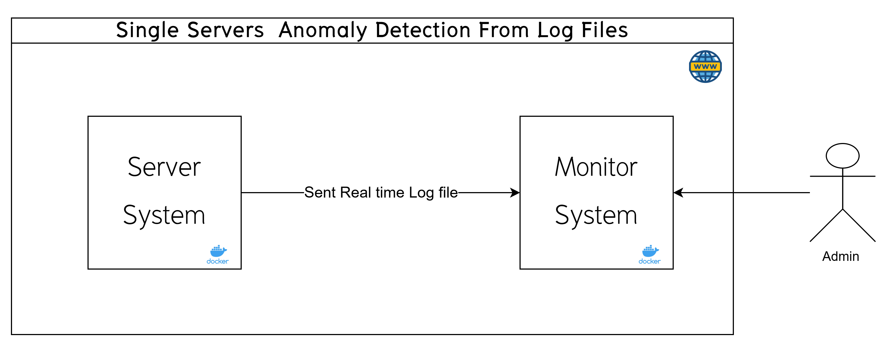
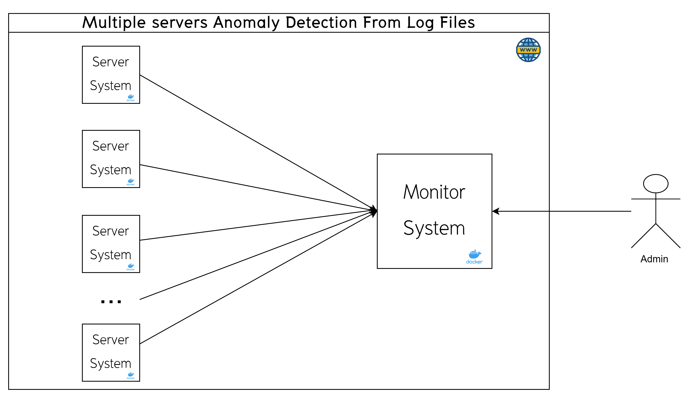
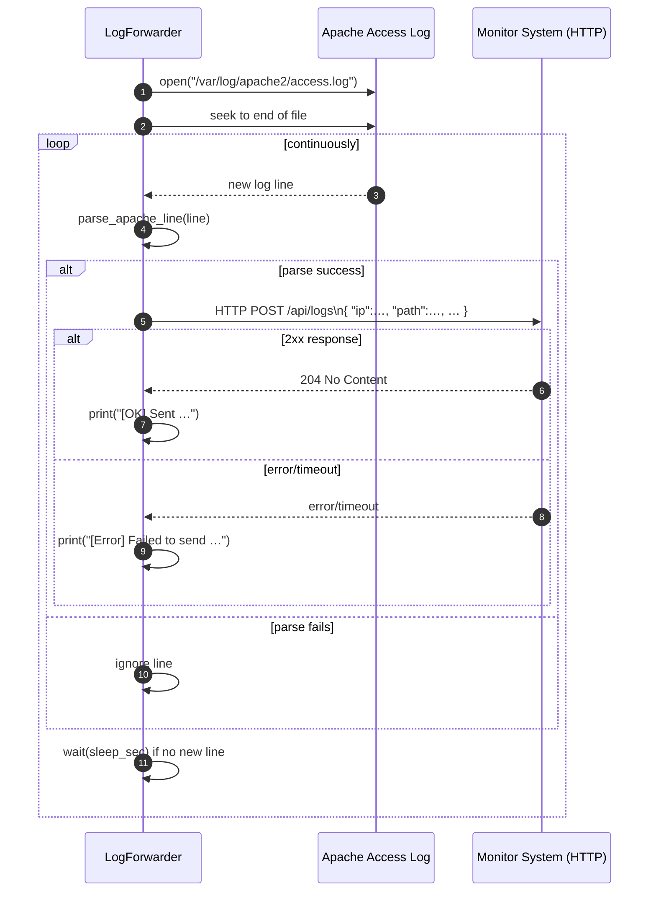
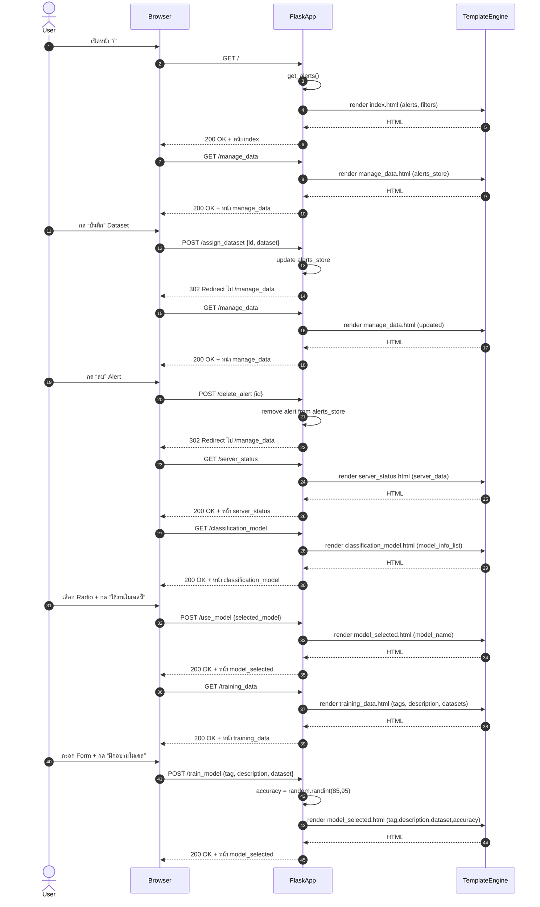

# การตรวจจับเหตุการณ์ผิดปกติจากข้อมูลการจราจรทางคอมพิวเตอร์  (Anomaly Detection From Log Files)

- โครงการสำหรับ การตรวจจับเหตุการณ์ผิดปกติจากข้อมูลการจราจรทางคอมพิวเตอร์ โดยใช้เทคนิคการเรียนรู้ของเครื่อง (Machine Learning) และการวิเคราะห์ข้อมูล (Data Analysis) เพื่อช่วยในการตรวจสอบและวิเคราะห์เหตุการณ์ที่เกิดขึ้นในระบบคอมพิวเตอร์  
- 
##  flow logs app 

# System Architecture 

-  Single Servers  Anomaly Detection From Log Files
-  
-  Multi Servers Anomaly Detection From Log Files  
- 

## System 1 (LogForwarder)
- Sequence Diagram

## System 2 (Monitor System) 

