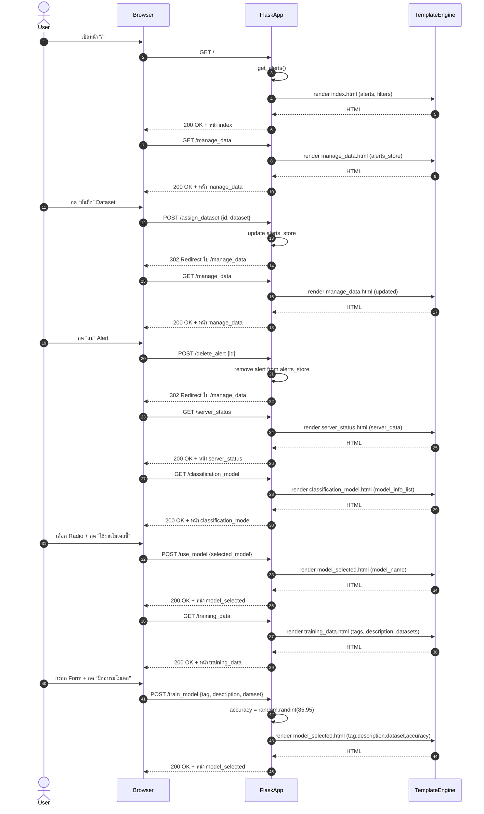

# Flask Web Application Flowchart 
## frontend  System Design
- 
## backend  System Design

```mermaid
sequenceDiagram
    autonumber
    actor User
    participant Browser
    participant FlaskApp
    participant TemplateEngine

    %% 1) หน้าแรก + กรอง Alert
    User->>Browser: เปิดหน้า "/"
    Browser->>FlaskApp: GET /
    FlaskApp->>FlaskApp: get_alerts()
    FlaskApp->>TemplateEngine: render index.html (alerts, filters)
    TemplateEngine-->>FlaskApp: HTML
    FlaskApp-->>Browser: 200 OK + หน้า index

    %% 2) จัดการข้อมูลจากระบบที่ 1
    Browser->>FlaskApp: GET /manage_data
    FlaskApp->>TemplateEngine: render manage_data.html (alerts_store)
    TemplateEngine-->>FlaskApp: HTML
    FlaskApp-->>Browser: 200 OK + หน้า manage_data

    User->>Browser: กด “บันทึก” Dataset
    Browser->>FlaskApp: POST /assign_dataset {id, dataset}
    FlaskApp->>FlaskApp: update alerts_store
    FlaskApp-->>Browser: 302 Redirect ไป /manage_data
    Browser->>FlaskApp: GET /manage_data
    FlaskApp->>TemplateEngine: render manage_data.html (updated)
    TemplateEngine-->>FlaskApp: HTML
    FlaskApp-->>Browser: 200 OK + หน้า manage_data

    User->>Browser: กด “ลบ” Alert
    Browser->>FlaskApp: POST /delete_alert {id}
    FlaskApp->>FlaskApp: remove alert from alerts_store
    FlaskApp-->>Browser: 302 Redirect ไป /manage_data

    %% 3) ดูสถานะเซิร์ฟเวอร์
    Browser->>FlaskApp: GET /server_status
    FlaskApp->>TemplateEngine: render server_status.html (server_data)
    TemplateEngine-->>FlaskApp: HTML
    FlaskApp-->>Browser: 200 OK + หน้า server_status

    %% 4) เลือกโมเดลจำแนกประเภท
    Browser->>FlaskApp: GET /classification_model
    FlaskApp->>TemplateEngine: render classification_model.html (model_info_list)
    TemplateEngine-->>FlaskApp: HTML
    FlaskApp-->>Browser: 200 OK + หน้า classification_model

    User->>Browser: เลือก Radio + กด “ใช้งานโมเดลนี้”
    Browser->>FlaskApp: POST /use_model {selected_model}
    FlaskApp->>TemplateEngine: render model_selected.html (model_name)
    TemplateEngine-->>FlaskApp: HTML
    FlaskApp-->>Browser: 200 OK + หน้า model_selected

    %% 5) เลือกข้อมูลสำหรับฝึกอบรม
    Browser->>FlaskApp: GET /training_data
    FlaskApp->>TemplateEngine: render training_data.html (tags, description, datasets)
    TemplateEngine-->>FlaskApp: HTML
    FlaskApp-->>Browser: 200 OK + หน้า training_data

    User->>Browser: กรอก Form + กด “ฝึกอบรมโมเดล”
    Browser->>FlaskApp: POST /train_model {tag, description, dataset}
    FlaskApp->>FlaskApp: accuracy = random.randint(85,95)
    FlaskApp->>TemplateEngine: render model_selected.html (tag,description,dataset,accuracy)
    TemplateEngine-->>FlaskApp: HTML
    FlaskApp-->>Browser: 200 OK + หน้า model_selected
```